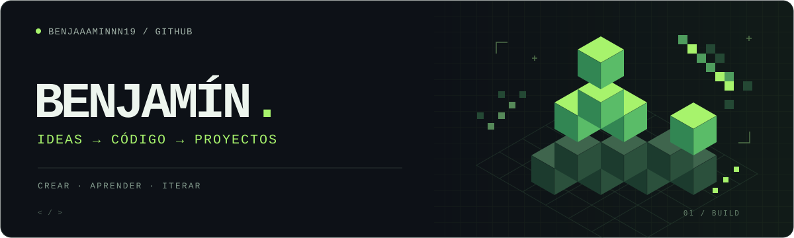
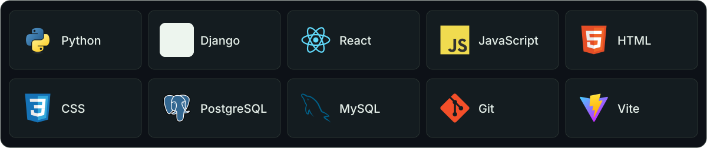
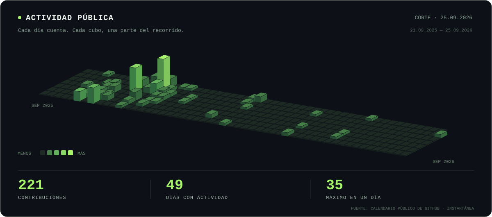

  

<h1 align="center">Hola, soy Benjamín 👋</h1>

<strong>Desarrollo web · Python & Django · React</strong>

Convirtiendo ideas en proyectos, un commit a la vez.

  <a href="#-sobre-mí">Sobre mí</a> ·
  <a href="#-tecnologías">Tecnologías</a> ·
  <a href="#-proyectos-destacados">Proyectos</a> ·
  <a href="https://github.com/Benjaaaminnn19?tab=repositories">Ver repositorios ↗</a>

---

## 🟩 Sobre mí

Soy Benjamín. En este espacio comparto mis proyectos de desarrollo web: desde interfaces con **React** hasta aplicaciones y APIs con **Python y Django**.

Me interesa conectar lo que ve el usuario con la lógica y los datos que hacen funcionar una aplicación. Mis repositorios incluyen proyectos de gestión, una aplicación de gimnasio con tienda e integraciones entre backend y frontend.

**Mi enfoque:** aprender construyendo, resolver problemas concretos y mejorar con cada proyecto.

## 🧩 Tecnologías

  

## 🚀 Proyectos destacados

<table>
  <tr>
    <td width="50%" valign="top">
      <h3>01 / Gimnasio & tienda</h3>
      
Aplicación web con catálogo de productos y gestión de órdenes para un gimnasio.

      
<code>Python</code> <code>Django</code> <code>PostgreSQL</code>

      <a href="https://github.com/Benjaaaminnn19/djangogm"><strong>Explorar djangogm →</strong></a>
    </td>
    <td width="50%" valign="top">
      <h3>02 / Backend + frontend</h3>
      
Proyecto que reúne una API con Django REST Framework y una interfaz con React y Vite.

      
<code>Django REST</code> <code>React</code> <code>MySQL</code>

      <a href="https://github.com/Benjaaaminnn19/backend-y-frontend"><strong>Explorar el proyecto →</strong></a>
    </td>
  </tr>
  <tr>
    <td width="50%" valign="top">
      <h3>03 / SoftwareApp</h3>
      
Aplicación de gestión de calificaciones tributarias con roles de usuario, carga de datos y reportes.

      
<code>Python</code> <code>Django</code> <code>Gestión de datos</code>

      <a href="https://github.com/Benjaaaminnn19/SoftwareApp"><strong>Explorar SoftwareApp →</strong></a>
    </td>
    <td width="50%" valign="top">
      <h3>04 / Práctica con React</h3>
      
Proyecto de frontend para desarrollar interfaces y trabajar con navegación mediante React Router.

      
<code>JavaScript</code> <code>React</code> <code>React Router</code>

      <a href="https://github.com/Benjaaaminnn19/actividadreact"><strong>Explorar actividadreact →</strong></a>
    </td>
  </tr>
</table>

## 📊 Actividad en GitHub

  

Instantánea de la actividad pública al 25 de septiembre de 2026. Consulta las contribuciones actualizadas en mi perfil.

---

<strong>Gracias por visitar mi espacio.</strong> Cada proyecto es una oportunidad para aprender algo nuevo.

<a href="https://github.com/Benjaaaminnn19?tab=repositories">Explora mis repositorios ↗</a> · <a href="https://github.com/Benjaaaminnn19?tab=stars">Mis favoritos ☆</a>

